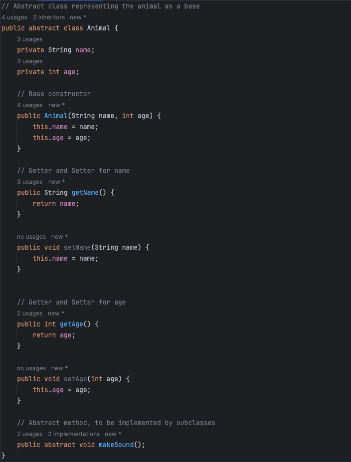
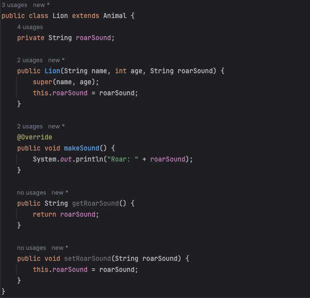
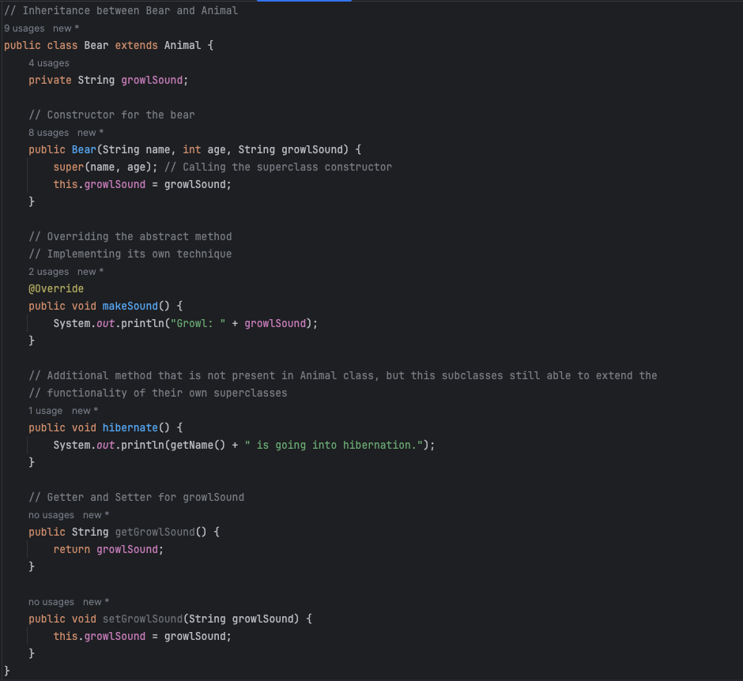
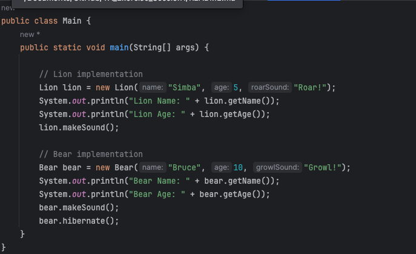
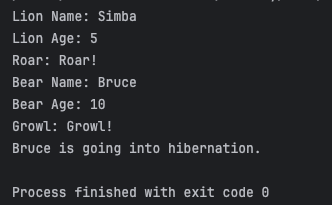

# TA Exercise 1

# Exercise 1
Look at the file named, `Answers.md`

# Exercise 2
## OOP Principles Demo in Java

This repository demonstrates four fundamental principles of Object-Oriented Programming (OOP) in Java:
1. Inheritance
2. Encapsulation
3. Polymorphism
4. Abstraction

Using a simple example, looking at the properties and behaviours of different Animals.

## Structure

- **Animal.java**: An abstract class representing a generic animal. It demonstrates encapsulation and abstraction.
- **Lion.java**: A class that extends `Animal`, demonstrates inheritance and polymorphism.
- **Bear.java**: Another class that extends `Animal`, demonstrates inheritance and polymorphism. _Additional method_
- **Main.java**: A driver class to run the code and demonstrate the principles in action.

## Run the code

To run the code, compile and execute the `Main.java` file.

## OOP Principles explained in the code

I will be explaining the principles  using `Animal.java` and `Bear.java`. As `Lion.java` are basically the same as 
`Bear.java`

### 1. Encapsulation
The `Animal` class encapsulates the name and age properties by making them private and providing public getters and 
setters.
In `Bear` class, the growlSound property is being encapsulated within the class. With private access modifier and 
public getter and setter method for it to be accessible and modified.
### 2. Abstraction
The `Animal` class is an abstract class, because for the `Animal` class will become the generic base which is going 
to be 
used as a concept. The concept that defines common properties/behaviours of different Animal classes. Which they can 
still be 
inherited and extended by subclasses.

### 3. Inheritance
The `Bear` class extends the `Animal` class, demonstrating inheritance. `Bear` inherits all public and protected 
members from `Animal` class.

### 4. Polymorphism
The `makeSound` method in the `Bear` class overrides the abstract method from the `Animal` class, demonstrating 
polymorphism. This make `Bear` class able to be able to provide their own implementation of the method.

# Screenshots of the Code and Results

### Code for the Animal.java class

### Code for the Lion.java class

### Code for the Bear.java class

### Code for the Main.java class

### Result of running the code
